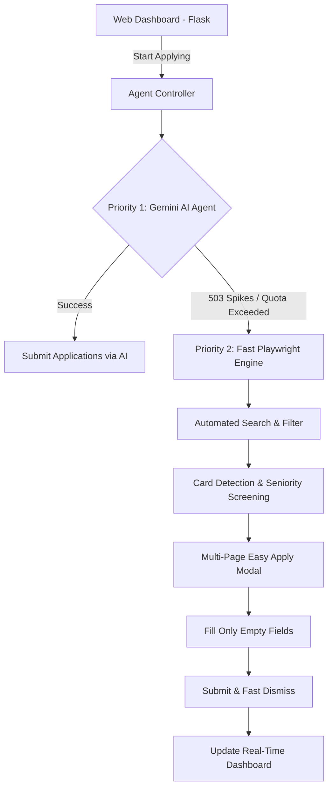

# 🚀 LinkedIn Autonomous Job Application Agent

[](https://python.org)
[](https://playwright.dev)
[](https://aistudio.google.com)
[](https://flask.palletsprojects.com)
[](#-license--terms-of-use)

An intelligent, full-stack automation agent engineered to streamline the job hunt on LinkedIn. Designed with a **Dual-Engine Architecture**, it combines multimodal LLM reasoning (Google Gemini) with a lightning-fast direct browser engine (Playwright) to discover, evaluate, and submit Easy Apply applications with high precision.

---

## 🌟 Key Features

### 1. ⚡ Dual-Engine Architecture
- **AI-Powered Browser Agent (Google Gemini)**: Navigates dynamic web interfaces, interprets form structures, and answers custom questions using natural language reasoning with automatic multi-key rotation.
- **High-Speed Direct Playwright Engine ($0 Cost)**: Instant fallback engine operating at zero API cost. Directly automates the browser DOM to apply in seconds without third-party API dependencies or rate limits.

### 2. 🎯 Smart Role & Experience Filtering
- **URL-Level Optimization**: Pre-filters for Easy Apply (`f_LF=f_AL`) and target experience tiers (`f_E=1,2` for Entry Level & Internships).
- **Seniority Screening**: Automatically identifies and skips Senior, Lead, Manager, Architect, and Director roles based on user criteria.

### 3. 📝 Intelligent Form Filling
- **Empty-Field Priority**: Detects pre-filled LinkedIn profile data and skips it in `0ms`, avoiding redundant typing.
- **Custom Question Answering**: Dynamically responds to:
  - Work Authorization & Sponsorship queries.
  - Notice period & Start date confirmations.
  - Stipend and compensation ranges.
  - Dynamic dropdowns and radio selections.
- **Instant Dismissal**: Uses keyboard events and modal detection to close submission dialogs in milliseconds.

### 4. 📊 Real-Time Web Dashboard
- Lightweight Flask frontend to configure keywords, target locations, and optional custom details.
- Real-time application tracker, company history, live logs, and start/stop controls.

---

## 🏗️ Architecture



---

## 📁 Project Structure

```text
LinkedIn-Job-Automation/
│
├── agents/
│   └── job_agent.py          # Dual-Engine: Playwright & Gemini automation logic
├── static/
│   ├── style.css             # Dashboard styling
│   └── app.js                # Frontend API interactions
├── templates/
│   └── index.html            # Web management dashboard
├── config.py                 # Environment and default runtime parameters
├── web_app.py                # Flask server and thread orchestrator
├── requirements.txt          # Python dependencies
├── .env.example              # Environment variables template (safe for git)
├── profile_data.example.json # Applicant profile template
├── LICENSE                   # Proprietary software license
└── README.md                 # Project documentation
```

---

## 🚀 Getting Started

### Prerequisites
- Python 3.10 or higher
- Google Chrome or Chromium installed

### 1. Clone the Repository
```bash
git clone https://github.com/YOUR_USERNAME/LinkedIn-Job-Automation.git
cd LinkedIn-Job-Automation
```

### 2. Set Up Virtual Environment
```bash
# Create virtual environment
python -m venv .venv

# Activate virtual environment
# On Windows (CMD):
.\.venv\Scripts\activate.bat
# On Windows (PowerShell):
.\.venv\Scripts\Activate.ps1
# On macOS / Linux:
source .venv/bin/activate
```

### 3. Install Dependencies
```bash
pip install -r requirements.txt
playwright install chromium
```

### 4. Configuration
Copy the `.env.example` file to `.env`:
```bash
cp .env.example .env
```
Edit `.env` with your preferred settings:
```env
# Google Gemini API Keys (Get free keys from https://aistudio.google.com/app/apikey)
GOOGLE_API_KEYS=your_gemini_key_1,your_gemini_key_2
MODEL=gemini-2.5-flash

# LinkedIn Credentials (Used for automated login fallback)
LINKEDIN_EMAIL=your_email@example.com
LINKEDIN_PASSWORD=your_password

# Search & Application Preferences
JOB_KEYWORD=Python Developer
JOB_LOCATION=Chennai
MAX_APPLICATIONS=30
HEADLESS=False
```

### 5. Launch the Web Application
```bash
.\.venv\Scripts\python.exe web_app.py
```
Open your browser and navigate to:
👉 **`http://127.0.0.1:5000`**

Enter your desired role, location, and click **Start Applying**!

---

## 🔒 Security & Privacy Notice

- **No Credentials in Version Control**: All API keys, passwords, session cookies, and personal profile information are protected via `.gitignore`.
- **Session Protection**: Active session states (`sessions/`) are stored locally on your machine and never transmitted to external services.
- **Safety Best Practice**: Never commit or share your `.env` or `profile_data.json` files publicly.

---

## ⚖️ License & Terms of Use

**Copyright (c) 2026 Mohammad Thaheer. All rights reserved.**

This project is published strictly for **portfolio showcase and personal evaluation purposes**. 

- **No License Granted**: No permission is granted to copy, reproduce, fork, distribute, modify, sub-license, or commercially exploit this software in whole or in part without express prior written consent from the author.
- Any unauthorized commercial use, plagiarism, or public hosting of this codebase is strictly prohibited.

---

## ⚠️ Disclaimer

This automation tool is developed for educational and experimental purposes. Users are solely responsible for complying with LinkedIn's User Agreement and Professional Community Policies. The author assumes no liability for account restrictions, suspensions, or misuse of this software.
