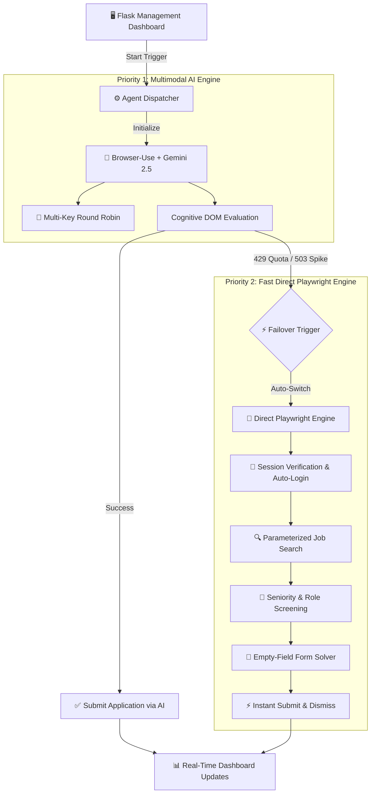

<div align="center">

# 🚀 Autonomous LinkedIn Job Application Agent
### *Full-Stack Dual-Engine AI & Browser Automation Platform*

[](https://python.org)
[](https://playwright.dev)
[](https://aistudio.google.com)
[](https://flask.palletsprojects.com)
[](LICENSE)

<p align="center">
  <b>Eliminate repetitive job applications with intelligent multimodal reasoning and high-throughput browser automation.</b>
</p>

[Key Features](#-key-features) • [Engine Comparison](#-dual-engine-benchmarks) • [Architecture](#-system-architecture) • [Getting Started](#-getting-started) • [Security](#-security--data-privacy) • [Author](#-author)

---

</div>

## 📌 Executive Summary

Applying for jobs across modern professional networks often requires answering repetitive questionnaires, navigating dynamic single-page applications, and encountering unpredictable modal dialogs. 

This project is an **Autonomous Job Application Agent** designed to automate LinkedIn's **Easy Apply** pipeline end-to-end. Engineered with a **Dual-Engine Architecture**, it pairs the contextual comprehension of **Google Gemini LLM** with the deterministic speed of a **Direct Playwright Automation Engine**, delivering high accuracy and zero-downtime execution.

---

## 🌟 Key Features

### ⚡ 1. Dual-Engine Architecture
* **AI Cognitive Mode (Google Gemini)**: Analyzes unstructured application questions, custom requirements, and multi-step forms using multimodal reasoning and round-robin multi-key rotation.
* **Direct Playwright Engine ($0 Cost)**: Deterministic, high-throughput browser engine that interacts directly with LinkedIn's DOM tree, applying to eligible openings in seconds without incurring API costs or rate-limit delays.
* **Intelligent Auto-Failover**: If the AI engine experiences quota exhaustion (`429`) or server load spikes (`503`), execution seamlessly transitions to the Direct Playwright Engine without user intervention.

### 🎯 2. Precision Job Screening
* **Experience Matching**: Automates URL-level filters (`f_LF=f_AL` for Easy Apply, `f_E=1,2` for Entry & Intern tiers).
* **Seniority Exclusion**: Automatically detects and skips Senior, Lead, Manager, Architect, and Director roles based on target preferences.

### 📝 3. Optimized Form-Filling Engine
* **Zero-Latency Bypass**: Instantly skips fields pre-populated by LinkedIn profile data in `0ms`, preventing redundant keystrokes.
* **Fuzzy Question Mapping**: Dynamically handles dynamic fields:
  * Work authorization & Visa sponsorship.
  * Salary expectations, stipends, and compensation ranges.
  * Notice periods and immediate joining dates.
  * Multi-select dropdowns, radio fieldsets, and compliance checkboxes.
* **Instant Submission & Dismissal**: Dispatches keyboard dismiss events to close confirmation dialogs in milliseconds.

### 📊 4. Full-Stack Monitoring Dashboard
* Real-time Flask management dashboard providing real-time application counters, target role selectors, live log monitoring, and safety abort controls.

---

## 📊 Dual-Engine Benchmarks

| Metric / Dimension | Priority 1: Gemini AI Agent | Priority 2: Direct Playwright Engine |
| :--- | :--- | :--- |
| **Primary Focus** | Unstructured question reasoning | Maximum execution speed |
| **API Cost** | Free tier (Multi-Key Rotation) | **$0.00 (Zero API dependencies)** |
| **Average Apply Speed** | ~15 – 25 sec / application | **~3 – 5 sec / application** |
| **Rate Limit Sensitivity** | Handled via key cycler | **Immune to API limits** |
| **Form Adaptability** | Autonomous reasoning | Deterministic DOM heuristics |

---

## 🏗️ System Architecture



---

## 📁 Repository Layout

```text
LinkedIn-Job-Automation/
├── agents/
│   └── job_agent.py              # Core Dual-Engine logic (Gemini + Playwright)
├── static/
│   ├── style.css                 # Modern dark-mode UI styling
│   └── script.js                 # Real-time state polling & API interactions
├── templates/
│   └── index.html                # Responsive web dashboard interface
├── config.py                     # Centralized settings & environment mapper
├── web_app.py                    # Flask application & asynchronous thread manager
├── requirements.txt              # Production dependency specifications
├── .env.example                  # Environment configuration template (safe for git)
├── profile_data.example.json     # Standardized profile schema template
├── LICENSE                       # Proprietary copyright license
└── README.md                     # Comprehensive documentation
```

---

## 🚀 Quickstart & Setup

### 1. Clone the Repository
```bash
git clone https://github.com/mohammadthaheer2005/LinkedIn-Job-Automation.git
cd LinkedIn-Job-Automation
```

### 2. Configure Environment
```bash
# Create virtual environment
python -m venv .venv

# Activate on Windows:
.\.venv\Scripts\activate.bat

# Install dependencies:
pip install -r requirements.txt
playwright install chromium
```

### 3. Setup Credentials
Copy `.env.example` to `.env`:
```bash
copy .env.example .env
```
Populate your `.env` configuration:
```env
# Google Gemini API Keys (comma-separated for auto-rotation)
GOOGLE_API_KEYS=your_gemini_api_key_1,your_gemini_api_key_2
MODEL=gemini-2.5-flash

# LinkedIn Credentials (for automated session generation)
LINKEDIN_EMAIL=your_email@example.com
LINKEDIN_PASSWORD=your_password

# Application Settings
JOB_KEYWORD=Python Developer
JOB_LOCATION=Chennai
MAX_APPLICATIONS=30
HEADLESS=False
```

### 4. Run the Application
```bash
python web_app.py
```
Open **`http://127.0.0.1:5000`** in your browser, enter your target role and parameters, and click **Start Applying**!

---

## 🔒 Security & Data Privacy

* **Zero Secret Leakage**: The repository strictly enforces `.gitignore` rules preventing `.env`, `sessions/`, `profile_data.json`, and local PDF resumes from ever being committed.
* **Local Session Isolation**: Authentication cookies are generated and encrypted locally in the `sessions/` directory and never transmitted to external logging or cloud tracking services.

---

## ⚖️ License & Terms of Use

**Copyright © 2026 Mohammad Thaheer. All rights reserved.**

This software is published strictly for **personal portfolio demonstration and professional evaluation**. 
* **No License Granted**: Unauthorized reproduction, modification, duplication, commercial exploitation, or redistribution of this codebase without prior written consent from the copyright holder is strictly prohibited.
* Please review the [`LICENSE`](LICENSE) file for detailed legal terms.

---

## 👨‍💻 Author

**Mohammad Thaheer**  
*Full-Stack & Autonomous AI Systems Developer*  
- **GitHub**: [@mohammadthaheer2005](https://github.com/mohammadthaheer2005)  
- **Projects**: [LinkedIn Automation](https://github.com/mohammadthaheer2005/LinkedIn-Job-Automation) • [Browser Agent](https://github.com/mohammadthaheer2005/browser--agent) • [Career Advisor](https://github.com/mohammadthaheer2005/career-advisor)
